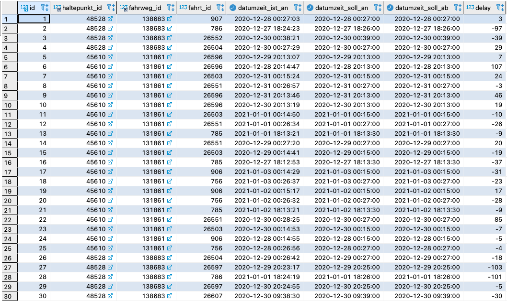
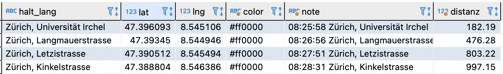

# Praktikum: Datenbank-Migration 👨‍💻

Analyse der Fahrzeiten 2020 der VBZ im SOLL-IST-Vergleich.
In diesem Praktikum soll eine Datenbank der VBZ Zürich importiert und verfügbar gemacht werden.

Meine Aufgabe war es, die Abfragen für die Linie 5 zu erstellen.

## 📝 Aufgabe 1: Aufgabenstellung verstehen

Bei dieser Aufgabe gibt es nichts zu lösen, es geht lediglich um das Verständnis.

## 📝 Aufgabe 2: Datenquellen einrichten

### Aufgabenbeschreibung

Um die Datenquellen einzurichten werden im Aufgaben Dokument alle notwendigen Schritte erläutert.

### Lösung

Um die Aufgaben lösen zu können, muss jedoch eine Datenbank erstellt werden.

#### Script

```
DROP SCHEMA IF EXISTS vbzdat;
CREATE SCHEMA vbzdat DEFAULT CHARACTER SET utf8;
USE vbzdat;
```

Link zum Script: [SQL Script](Scripts/a2.sql)

## 📝 Aufgabe 3: Migration Haltepunkt

In dieser Aufgabe werden die Haltepunkte migriert. Die notwendigen Schritte werden im Aufgaben Dokument erklärt.

## 📝 Aufgabe 4: Migration Haltestelle

In dieser Aufgabe werden die Haltestellen migriert. Die notwendigen Schritte werden im Aufgaben Dokument erklärt.

## 📝 Aufgabe 5: Migration Fahrzeiten Soll Ist

In dieser Aufgabe werden die Fahrzeiten Soll Ist migriert. Die notwendigen Schritte werden im Aufgaben Dokument erklärt.

## 📝 Aufgabe 6: Bereinigung der Tabellen und Constraints

### Aufgabenbeschreibung

Bei der Bereinigung der Tabellen geht es um das Hinzufügen von Primärschlüsseln und die Verwendung der korrekten Datentypen (zum Beispiel für Date).

### Lösung

#### Script

```
use vbzdat;

# Schritt 1
ALTER TABLE fahrzeiten_soll_ist ADD id INT PRIMARY KEY AUTO_INCREMENT FIRST;

# Schritt 2
ALTER TABLE fahrzeiten_soll_ist ADD CONSTRAINT fahrzeiten_soll_ist_FK FOREIGN KEY (halt_punkt_id_von) REFERENCES haltepunkt(halt_punkt_id);
ALTER TABLE fahrzeiten_soll_ist ADD CONSTRAINT fahrzeiten_soll_ist_FK_1 FOREIGN KEY (halt_punkt_id_nach) REFERENCES haltepunkt(halt_punkt_id);

# Schritt 3
ALTER TABLE haltepunkt ADD CONSTRAINT haltepunkt_FK FOREIGN KEY (halt_id) REFERENCES haltestelle(halt_id);

# Schritt 4
ALTER TABLE fahrzeiten_soll_ist ADD betriebs_datum DATE NULL;
ALTER TABLE fahrzeiten_soll_ist ADD datumzeit_soll_an_von DATETIME NULL;
ALTER TABLE fahrzeiten_soll_ist ADD datumzeit_ist_an_von DATETIME NULL;
ALTER TABLE fahrzeiten_soll_ist ADD datumzeit_soll_ab_von DATETIME NULL;
ALTER TABLE fahrzeiten_soll_ist ADD datumzeit_ist_ab_von DATETIME NULL;
ALTER TABLE fahrzeiten_soll_ist ADD datum__nach DATE NULL;

# Schritt 5
UPDATE fahrzeiten_soll_ist SET betriebs_datum = STR_TO_DATE(betriebsdatum ,'%d.%m.%Y');
UPDATE fahrzeiten_soll_ist SET datumzeit_soll_an_von = DATE_ADD(STR_TO_DATE(datum_von,'%d.%m.%Y'), INTERVAL soll_an_von SECOND);
UPDATE fahrzeiten_soll_ist SET datumzeit_ist_an_von = DATE_ADD(STR_TO_DATE(datum_von,'%d.%m.%Y'), INTERVAL ist_an_von SECOND);
UPDATE fahrzeiten_soll_ist SET datumzeit_soll_ab_von = DATE_ADD(STR_TO_DATE(datum_von,'%d.%m.%Y'), INTERVAL soll_ab_von SECOND);
UPDATE fahrzeiten_soll_ist SET datumzeit_ist_ab_von = DATE_ADD(STR_TO_DATE(datum_von,'%d.%m.%Y'), INTERVAL ist_ab_von SECOND);
UPDATE fahrzeiten_soll_ist SET datum__nach =STR_TO_DATE(datum_nach ,'%d.%m.%Y');

# Schritt 6
ALTER TABLE fahrzeiten_soll_ist ADD datumzeit_soll_an_nach DATETIME NULL;
ALTER TABLE fahrzeiten_soll_ist ADD datumzeit_ist_an_nach DATETIME NULL;
ALTER TABLE fahrzeiten_soll_ist ADD datumzeit_soll_ab_nach DATETIME NULL;
ALTER TABLE fahrzeiten_soll_ist ADD datumzeit_ist_ab_nach DATETIME NULL;

# Schritt 7
UPDATE fahrzeiten_soll_ist SET datumzeit_soll_an_nach = DATE_ADD(STR_TO_DATE(datum_von,'%d.%m.%Y'), INTERVAL soll_an_nach SECOND);
UPDATE fahrzeiten_soll_ist SET datumzeit_ist_an_nach = DATE_ADD(STR_TO_DATE(datum_von,'%d.%m.%Y'), INTERVAL ist_an_nach SECOND);
UPDATE fahrzeiten_soll_ist SET datumzeit_soll_ab_nach = DATE_ADD(STR_TO_DATE(datum_von,'%d.%m.%Y'), INTERVAL soll_ab_nach SECOND);
UPDATE fahrzeiten_soll_ist SET datumzeit_ist_ab_nach = DATE_ADD(STR_TO_DATE(datum_von,'%d.%m.%Y'), INTERVAL ist_ab_nach SECOND);

```

Link zum Script: [SQL Script](Scripts/a6.sql)

#### ERD

Beim Schritt 3 wird ein ERD verlangt. Das wurde erstellt und sieht wie folgt aus:


## 📝 Aufgabe 7: Erstellen Sie eine Abfrage über Zeitdifferenzen

### Aufgabenbeschreibung

Erstellen Sie eine Abfrage, welche die Zeitdifferenzen anzeigt. Für die Zeitdifferenzen sollen nur die von-Zeiten betrachtet werden.

### Lösung

Es wurde eine Generelle Abfrage für alle und eine spezifische Abfrage erstellt. Die spezifische Abfrage gilt für die Fahrt mit der ID 720 vom 27.12.20.

#### Ausgabe Generell

```
# Generell
SELECT
fsi.linie, fsi.richtung, fsi.fahrzeug,
fsi.kurs,
fsi.seq_von, fsi.halt_id_von, fsi.halt_id_nach, fsi.halt_punkt_id_von, fsi.halt_punkt_id_nach, fsi.fahrt_id, fsi.fahrweg_id, fsi.fw_no,
fsi.fw_typ,
fsi.fw_kurz,
fsi.fw_lang, fsi.betriebs_datum, fsi.datumzeit_soll_an_von, fsi.datumzeit_ist_an_von, fsi.datumzeit_soll_ab_von, fsi.datumzeit_ist_ab_von, fsi.datum__nach,
TIMEDIFF (datumzeit_soll_an_von, datumzeit_ist_an_von) as timediff_an,
TIMESTAMPDIFF (SECOND, datumzeit_soll_an_von, datumzeit_ist_an_von) as timediff_an_seconds,
TIMEDIFF (datumzeit_soll_ab_von, datumzeit_ist_ab_von) as timediff_ab,
TIMESTAMPDIFF (SECOND, datumzeit_soll_ab_von, datumzeit_ist_ab_von) as timediff_ab_seconds,
TIMESTAMPDIFF (SECOND, datumzeit_soll_an_von, datumzeit_soll_ab_von) as halt_soll_time_seconds,
TIMESTAMPDIFF (SECOND, datumzeit_ist_an_von, datumzeit_ist_ab_von) as halt_ist_time_seconds
FROM fahrzeiten_soll_ist fsi
LIMIT 40000;
```

Das Bild zeigt nur einen Ausschnitt der Tabelle, da sehr viele Felder abgefragt werden.


#### Spezifische Ausgabe

Gilt für die Fahrt mit der ID 720 vom 27.12.20.

```
# Fuer die Linie 5, am 27.12.20 mit der Fahrt ID 720
SELECT
fsi.linie, fsi.richtung, fsi.fahrzeug, fsi.kurs, fsi.seq_von,
fsi.halt_id_von, fsi.halt_id_nach, fsi.halt_punkt_id_von,
fsi.halt_punkt_id_nach, fsi.fahrt_id, fsi.fahrweg_id, fsi.fw_no,
fsi.fw_typ, fsi.fw_kurz,fsi.fw_lang, fsi.betriebs_datum,
fsi.datumzeit_soll_an_von, fsi.datumzeit_ist_an_von,
fsi.datumzeit_soll_ab_von, fsi.datumzeit_ist_ab_von, fsi.datum__nach,
TIMEDIFF (datumzeit_soll_an_von, datumzeit_ist_an_von) as timediff_an,
TIMESTAMPDIFF (SECOND, datumzeit_soll_an_von, datumzeit_ist_an_von) as timediff_an_seconds,
TIMEDIFF (datumzeit_soll_ab_von, datumzeit_ist_ab_von) as timediff_ab,
TIMESTAMPDIFF (SECOND, datumzeit_soll_ab_von, datumzeit_ist_ab_von) as timediff_ab_seconds,
TIMESTAMPDIFF (SECOND, datumzeit_soll_an_von, datumzeit_soll_ab_von) as halt_soll_time_seconds,
TIMESTAMPDIFF (SECOND, datumzeit_ist_an_von, datumzeit_ist_ab_von) as halt_ist_time_seconds
FROM fahrzeiten_soll_ist fsi
WHERE fsi.linie = 5 AND datum_von = '27.12.20' AND fahrt_id = 720
LIMIT 40000;
```

Das Bild zeigt nur einen Ausschnitt der Tabelle, da sehr viele Felder abgefragt werden.


#### Gesamtes Script

```
use vbzdat;

# Generell
SELECT
fsi.linie, fsi.richtung, fsi.fahrzeug,
fsi.kurs,
fsi.seq_von, fsi.halt_id_von, fsi.halt_id_nach, fsi.halt_punkt_id_von, fsi.halt_punkt_id_nach, fsi.fahrt_id, fsi.fahrweg_id, fsi.fw_no,
fsi.fw_typ,
fsi.fw_kurz,
fsi.fw_lang, fsi.betriebs_datum, fsi.datumzeit_soll_an_von, fsi.datumzeit_ist_an_von, fsi.datumzeit_soll_ab_von, fsi.datumzeit_ist_ab_von, fsi.datum__nach,
TIMEDIFF (datumzeit_soll_an_von, datumzeit_ist_an_von) as timediff_an,
TIMESTAMPDIFF (SECOND, datumzeit_soll_an_von, datumzeit_ist_an_von) as timediff_an_seconds,
TIMEDIFF (datumzeit_soll_ab_von, datumzeit_ist_ab_von) as timediff_ab,
TIMESTAMPDIFF (SECOND, datumzeit_soll_ab_von, datumzeit_ist_ab_von) as timediff_ab_seconds,
TIMESTAMPDIFF (SECOND, datumzeit_soll_an_von, datumzeit_soll_ab_von) as halt_soll_time_seconds,
TIMESTAMPDIFF (SECOND, datumzeit_ist_an_von, datumzeit_ist_ab_von) as halt_ist_time_seconds
FROM fahrzeiten_soll_ist fsi
LIMIT 40000;

# Fuer die Linie 5, am 27.12.20 mit der Fahrt ID 720
SELECT
fsi.linie, fsi.richtung, fsi.fahrzeug, fsi.kurs, fsi.seq_von,
fsi.halt_id_von, fsi.halt_id_nach, fsi.halt_punkt_id_von,
fsi.halt_punkt_id_nach, fsi.fahrt_id, fsi.fahrweg_id, fsi.fw_no,
fsi.fw_typ, fsi.fw_kurz,fsi.fw_lang, fsi.betriebs_datum,
fsi.datumzeit_soll_an_von, fsi.datumzeit_ist_an_von,
fsi.datumzeit_soll_ab_von, fsi.datumzeit_ist_ab_von, fsi.datum__nach,
TIMEDIFF (datumzeit_soll_an_von, datumzeit_ist_an_von) as timediff_an,
TIMESTAMPDIFF (SECOND, datumzeit_soll_an_von, datumzeit_ist_an_von) as timediff_an_seconds,
TIMEDIFF (datumzeit_soll_ab_von, datumzeit_ist_ab_von) as timediff_ab,
TIMESTAMPDIFF (SECOND, datumzeit_soll_ab_von, datumzeit_ist_ab_von) as timediff_ab_seconds,
TIMESTAMPDIFF (SECOND, datumzeit_soll_an_von, datumzeit_soll_ab_von) as halt_soll_time_seconds,
TIMESTAMPDIFF (SECOND, datumzeit_ist_an_von, datumzeit_ist_ab_von) as halt_ist_time_seconds
FROM fahrzeiten_soll_ist fsi
WHERE fsi.linie = 5 AND datum_von = '27.12.20' AND fahrt_id = 720
LIMIT 40000;

```

Link zum Script: [SQL Script](Scripts/a7.sql)

## 📝 Aufgabe 8: Linien Tabelle

### Aufgabenbeschreibung

Die Abfrage soll die Linie, die Richtung, die Fahrwegnummer und die Fahrwegbezeichnung enthalten.

### Lösung

#### Aufgabe a

Das Ergebnis zeigt, dass pro Linie (in diesem Fall 5) insgesamt 5 Varianten pro Richtung existieren. Der Grund ist, dass die Trams in ein Depo ein- und ausfahren sowie eine Linie je nach Tageszeit verkürzt geführt wird.

```
# Aufgabe a
SELECT DISTINCT fsi.linie, fsi.richtung, fsi.fw_no, fsi.fw_lang
FROM fahrzeiten_soll_ist fsi where fsi.linie = 5;
```


#### Aufgabe b

Erstellen Sie aus der Abfrage eine View query_line.

```
# Aufgabe b
CREATE OR REPLACE VIEW query_line
AS SELECT DISTINCT fsi.linie, fsi.richtung, fsi.fw_no, fsi.fw_lang
FROM fahrzeiten_soll_ist fsi where fsi.linie = 5;
```


#### Aufgabe c

Erstellen Sie ein Skript mit einer Tabellenerstellungsabfrage create_line_table.
Die Tabelle soll linie heissen. Der Primärschlüssel kann mit Hilfe von fahrweg_id gebildet werden.

```
# Aufgabe c
CREATE TABLE linie (PRIMARY KEY (fahrweg_id))
SELECT DISTINCT fsi.fahrweg_id, fsi.linie, fsi.richtung, fsi.fw_no, fsi.fw_lang
FROM fahrzeiten_soll_ist fsi where fsi.linie = 5;
```


#### Gesamtes Script

```
use vbzdat;

# Aufgabe a
SELECT DISTINCT fsi.linie, fsi.richtung, fsi.fw_no, fsi.fw_lang
FROM fahrzeiten_soll_ist fsi where fsi.linie = 5;

# Aufgabe b
CREATE OR REPLACE VIEW query_line
AS SELECT DISTINCT fsi.linie, fsi.richtung, fsi.fw_no, fsi.fw_lang
FROM fahrzeiten_soll_ist fsi where fsi.linie = 5;

# Aufgabe c
CREATE TABLE linie (PRIMARY KEY (fahrweg_id))
SELECT DISTINCT fsi.fahrweg_id, fsi.linie, fsi.richtung, fsi.fw_no, fsi.fw_lang
FROM fahrzeiten_soll_ist fsi where fsi.linie = 5;
```

Link zum Script: [SQL Script](Scripts/a8.sql)

## 📝 Aufgabe 9: Ankunftszeiten Tabelle

### Aufgabenbeschreibung

Es soll aus der fahrzeiten_soll_ist Tabelle eine vereinfachte Tabelle Ankunftszeiten erstellt werden.

Als Lösung wurde die direkte Variante mit einer Tabellenerstellungsabfrage gewählt.

### Lösung

#### Script

```
use vbzdat;

CREATE TABLE ankunftszeiten
SELECT fsi.halt_punkt_id_von as haltepunkt_id,
fsi.fahrweg_id, fsi.fahrt_id,
fsi.datumzeit_ist_an_von as datumzeit_ist_an,
fsi.datumzeit_soll_an_von as datumzeit_soll_an,
fsi.datumzeit_soll_ab_von as datumzeit_soll_ab,
TIMESTAMPDIFF (SECOND, fsi.datumzeit_soll_an_von, fsi.datumzeit_ist_an_von) as delay
FROM fahrzeiten_soll_ist fsi
WHERE fsi.linie = 5 AND fsi.seq_von = 1

UNION

SELECT fsi.halt_punkt_id_nach as haltepunkt_id,
fsi.fahrweg_id, fsi.fahrt_id,
fsi.datumzeit_ist_an_nach as datumzeit_ist_an,
fsi.datumzeit_soll_an_nach as datumzeit_soll_an,
fsi.datumzeit_soll_ab_nach as datumzeit_soll_ab,
TIMESTAMPDIFF (SECOND, fsi.datumzeit_soll_an_nach, fsi.datumzeit_ist_an_nach) as delay
FROM fahrzeiten_soll_ist fsi
WHERE fsi.linie = 5;

ALTER TABLE ankunftszeiten ADD id INT PRIMARY KEY auto_increment FIRST;
ALTER TABLE ankunftszeiten ADD CONSTRAINT fk1 FOREIGN KEY (haltepunkt_id) REFERENCES haltepunkt(halt_punkt_id);
ALTER TABLE ankunftszeiten ADD CONSTRAINT fk2 FOREIGN KEY (fahrweg_id) REFERENCES linie(fahrweg_id);
```

Link zum Script: [SQL Script](Scripts/a9.sql)

#### Ausschnitt der Tabelle:



#### Das resultierende ERD


## 📝 Aufgabe 10: Verspätungsliste pro Linie

### Aufgabenbeschreibung

Ermitteln Sie für eine Line (zum Beispiel Linie 9) eine Liste mit den 20 grössten Verspätungen. Visualisieren Sie die Daten mit Hilfe der Anwendung https://maps.co/gis/

### Lösung

Im unten verlinkten SQL Script befindet sich die Abfrage, sowie auch eine "temporäre" Tabelle um die Daten in das von maps.co/gis/ vordefinierte Format zu bringen. Diese Daten müssen dann als CSV exportiert und wieder in maps.co/gis/ importiert werden.

#### Ausgabe der Verspätungen (Select)

```
# 20 grösste Verspätungen
SELECT
a.id,
a.haltepunkt_id,
h2.halt_lang,
h.GPS_Latitude,
h.GPS_Longitude,
a.fahrweg_id,
l.linie,
a.datumzeit_ist_an,
a.datumzeit_soll_an,
a.delay
FROM ankunftszeiten a
LEFT JOIN haltepunkt h ON h.halt_punkt_id = a.haltepunkt_id
LEFT JOIN Haltestelle h2 ON h2.halt_id = h.halt_id
LEFT JOIN linie l on a.fahrweg_id = l.fahrweg_id
ORDER BY delay desc LIMIT 20
```


#### Ausgabe der Tabelle für den Export

```
# Tabelle für CSV Export
CREATE TABLE verspaetungen
SELECT
h.GPS_Latitude as lat,
h.GPS_Longitude as lng,
h2.halt_lang as name,
'#ff0000' as color,
CONCAT(a.delay, " Sekunden Verspätung, Haltestelle: ", h2.halt_lang) as note
FROM ankunftszeiten a
LEFT JOIN haltepunkt h ON h.halt_punkt_id = a.haltepunkt_id
LEFT JOIN Haltestelle h2 ON h2.halt_id = h.halt_id
LEFT JOIN linie l on a.fahrweg_id = l.fahrweg_id
ORDER BY delay desc LIMIT 20
```


#### Map Ausgabe

Nachdem das CSV in maps.co importiert wurde, erscheint folgende Ausgabe:


Ein Beispiel mit einem Pin:


#### Gesamtes Script und CSV

```
use vbzdat;

# 20 grösste Verspätungen
SELECT
a.id,
a.haltepunkt_id,
h2.halt_lang,
h.GPS_Latitude,
h.GPS_Longitude,
a.fahrweg_id,
l.linie,
a.datumzeit_ist_an,
a.datumzeit_soll_an,
a.delay
FROM ankunftszeiten a
LEFT JOIN haltepunkt h ON h.halt_punkt_id = a.haltepunkt_id
LEFT JOIN Haltestelle h2 ON h2.halt_id = h.halt_id
LEFT JOIN linie l on a.fahrweg_id = l.fahrweg_id
ORDER BY delay desc LIMIT 20

# Tabelle für CSV Export
CREATE TABLE verspaetungen
SELECT
h.GPS_Latitude as lat,
h.GPS_Longitude as lng,
h2.halt_lang as name,
'#ff0000' as color,
CONCAT(a.delay, " Sekunden Verspätung, Haltestelle: ", h2.halt_lang) as note
FROM ankunftszeiten a
LEFT JOIN haltepunkt h ON h.halt_punkt_id = a.haltepunkt_id
LEFT JOIN Haltestelle h2 ON h2.halt_id = h.halt_id
LEFT JOIN linie l on a.fahrweg_id = l.fahrweg_id
ORDER BY delay desc LIMIT 20
```

Das Script: [SQL Script](Scripts/a10.sql)

Das exportierte CSV: [CSV](csv/a10_verspaetungen.csv)

## 📝 Aufgabe 11: Graphische Visualisierung einer Linie

### Aufgabenbeschreibung

Ermitteln Sie über die Geokoordinaten eine graphische Visualisierung einer Linie. Sie können dazu die Anwendung unter https://maps.co/gis/ verwenden.

### Lösung

#### Script und CSV

```
use vbzdat;

# Tabelle für CSV Export
CREATE TABLE linie_713_visualisierung
SELECT
h.GPS_Latitude as lat,
h.GPS_Longitude as lng,
h2.halt_lang as name,
'#ff0000' as color,
CONCAT(a.delay, " Sekunden Verspätung, Haltestelle: ", h2.halt_lang) as note
FROM ankunftszeiten a
LEFT JOIN haltepunkt h ON h.halt_punkt_id = a.haltepunkt_id
LEFT JOIN Haltestelle h2 ON h2.halt_id = h.halt_id
WHERE a.fahrt_id = 713 AND DATE(a.datumzeit_ist_an) = '2021-01-01'
ORDER BY a.datumzeit_ist_an
```

Das Script: [SQL Script](Scripts/a11.sql)

Das exportierte CSV: [CSV](csv/a11_713.csv)

#### Ausgabe der Tabelle für den CSV Export


#### Map Ausgabe

Ausgabe der Linie 713, am 01.01.2021:


## 📝 Aufgabe 12: Fahrplan einer Linie

### Aufgabenbeschreibung

Extrahieren Sie aus der Tabelle Ankunftszeiten die Soll-Abfahrtszeiten für eine Linie für einen bestimmten Tag. Die notwendigen Angaben sind in fahrt_id, datum und linie.

Die Abfrage soll die Haltestellen und die Uhrzeit pro Linie sortiert nach fahrt_id und Uhrzeit (ohne Datum) anzeigen.

### Lösung

#### Script

```
use vbzdat;

SELECT a.fahrt_id as Fahrt, h2.halt_lang as Haltestelle, TIME_FORMAT(TIME(a.datumzeit_soll_ab),'%H:%i:%s') as Abfahrtzeit
FROM ankunftszeiten a
LEFT JOIN linie l on l.fahrweg_id = a.fahrweg_id
LEFT JOIN haltepunkt h ON h.halt_punkt_id = a.haltepunkt_id
LEFT JOIN Haltestelle h2 ON h2.halt_id = h.halt_id
WHERE l.linie = 5 and DATE(datumzeit_soll_ab) = '2021-01-1' AND a.fahrt_id = 713
ORDER BY a.fahrt_id, a.datumzeit_soll_ab ASC;
```

Link zum Script: [SQL Script](Scripts/a12.sql)

#### Ausgabe der Tabelle

Ein Ausschnitt des Ergebnisses für die Fahrt mit der ID 713:


## 📝 Aufgabe 13: Nächste Station zu meinem Standort

### Aufgabenbeschreibung

Wählen Sie eine GEO-Koordinate in Zürich. Ermitteln Sie eine Liste mit den 4 nächsten Stationen zu Ihrer Geokoordinate.

Visualisieren Sie Ihren Standort und die 4 nächsten Stationen mit Hilfe von https://maps.co/gis/.

Erstellen Sie eine Abfrage. Sie können die gewählte Geokoordinate direkt als Wert in der Abfrage verwenden.

### Lösung

Für die Lösung wurde die Fahrt mit der ID 713 vom 01.01.2021 verwendet.

#### Script und CSV

```
use vbzdat;

# Fuer die Ausgabe
set @userLAT=47.3977314;set @userLNG=8.5451337;

SELECT h2.halt_lang, h.GPS_Latitude as lat, h.GPS_Longitude as lng,
'#ff0000' as color,
CONCAT (TIME_FORMAT(TIME(a.datumzeit_ist_an),'%H:%i:%s'), " " , h2.halt_lang) as note,
ROUND(ST_Distance_Sphere(point(@userLNG , @userLAT), point(h.GPS_Longitude , h.GPS_Latitude)),2) as distanz
FROM ankunftszeiten a
LEFT JOIN haltepunkt h ON h.halt_punkt_id = a.haltepunkt_id
LEFT JOIN Haltestelle h2 ON h.halt_id = h2.halt_id
WHERE h.GPS_Latitude IS NOT NULL AND a.fahrt_id = 713 AND DATE(a.datumzeit_ist_an) = '2021-01-1'
ORDER BY distanz ASC
LIMIT 4;

# Fuer CSV Export
set @userLAT=47.3977314;set @userLNG=8.5451337;
CREATE TABLE next4
SELECT h2.halt_lang, h.GPS_Latitude as lat, h.GPS_Longitude as lng,
'#ff0000' as color,
CONCAT (TIME_FORMAT(TIME(a.datumzeit_ist_an),'%H:%i:%s'), " " , h2.halt_lang) as note,
ROUND(ST_Distance_Sphere(point(@userLNG , @userLAT), point(h.GPS_Longitude , h.GPS_Latitude)),2) as distanz
FROM ankunftszeiten a
LEFT JOIN haltepunkt h ON h.halt_punkt_id = a.haltepunkt_id
LEFT JOIN Haltestelle h2 ON h.halt_id = h2.halt_id
WHERE h.GPS_Latitude IS NOT NULL AND a.fahrt_id = 713 AND DATE(a.datumzeit_ist_an) = '2021-01-1'
ORDER BY distanz ASC
LIMIT 4;
```

Das Script: [SQL Script](Scripts/a13.sql)

Das exportierte CSV: [CSV](csv/a13.csv)

#### Ausgabe der Tabelle



#### Map Ausgabe

Der gelbe Marker ist der aktuelle Standort. Die roten Marker sind die 4 nächsten Haltestellen


## 📝 Aufgabe 14: Distanz zwischen zwei Haltestellen

### Aufgabenbeschreibung

Berechnen Sie für eine Linie die Distanz zwischen 2 Haltestellen. Sortieren Sie die Abfrage aufsteigend nach Distanz.

### Lösung

Ich habe für die Lösung die Fahrt mit der ID 713 am 01.01.2021 genommen.

#### Script

```
use vbzdat;

SELECT hh.halt_lang as von,
h2h.halt_lang as nach,
h.GPS_Latitude as vonLAT,
h.GPS_Longitude as vonLNG,
h2.GPS_Latitude as nachLAT,
h2.GPS_Longitude as nachLNG,
ROUND(ST_Distance_Sphere(point(h.GPS_Longitude , h.GPS_Latitude), point(h2.GPS_Longitude , h2.GPS_Latitude)),2) as distanz
FROM fahrzeiten_soll_ist fsi
LEFT JOIN haltepunkt h ON h.halt_punkt_id = fsi.halt_punkt_id_von
LEFT JOIN Haltestelle hh on h.halt_id = hh.halt_id
LEFT JOIN haltepunkt h2 ON h2.halt_punkt_id = fsi.halt_punkt_id_nach
LEFT JOIN Haltestelle h2h on h2.halt_id = h2h.halt_id
WHERE fsi.linie = 5 AND fsi.fahrt_id = 713 AND DATE(fsi.datumzeit_ist_an_von) = '2021-01-01'
ORDER BY distanz ASC;
```

Link zum Script: [SQL Script](Scripts/a14.sql)

#### Ausgabe der Tabelle


## 📝 Bonus Aufgabe

Da ich die Aufgabe 13 am Anfang falsch interpretiert habe, möchte ich trotzdem gerne mein Ergebnis hier Dokumentieren.

Ich hatte die Aufgabe so verstanden, dass aufgrund eines beliebigen Breiten- und Längengrades die zugehörige Haltestelle ermittelt werden muss. Danach sollen die zu der ermittelten Haltestelle nächsten 4 Haltestellen gemäss Fahrplan herausgefunden werden.

Bevor ich gemerkt habe, dass ich die Aufgabe falsch verstanden habe, habe ich ein Script geschrieben welches aufgrund von Breiten und Längengrad die nächste Haltestelle ermitteln kann.

### Das Script

```
SELECT h4.halt_lang FROM (
	SELECT fsi.halt_id_nach
	FROM fahrzeiten_soll_ist fsi
	WHERE fsi.halt_id_von IN (
		SELECT h.halt_id
		FROM ankunftszeiten a
		LEFT JOIN haltepunkt h ON h.halt_punkt_id = a.haltepunkt_id
		LEFT JOIN Haltestelle h2 ON h2.halt_id = h.halt_id
		WHERE h.GPS_Latitude = '47.396093' AND h.GPS_Longitude = '8.545106'
		GROUP BY h.halt_id
	)
	AND fsi.richtung = 1
	GROUP BY fsi.halt_id_nach
) as s1
LEFT JOIN haltepunkt h3 ON h3.halt_id = s1.halt_id_nach
LEFT JOIN Haltestelle h4 on h4.halt_id = h3.halt_id
WHERE h4.halt_lang NOT LIKE '%DEPOT%'
GROUP BY h4.halt_lang

```

Link zum Script: [SQL Script](Scripts/bonus.sql)

### Die Ausgabe


### Nächste Schritte

Um die Aufgabe zu vervollständigen, wäre eine Rekursion notwendig gewesen. Die Rekursion hätte jeweils die ermittelte "nach" ID der Haltestelle wieder als "von" ID der nächsten Iteration verwenden sollen. Die Wiederholung muss auf 4 Iterationen beschränkt werden.

An dieser Stelle habe ich die Aufgabe abgebrochen und die Zeit in die richtige Variante der Aufgabe 13 investiert.
